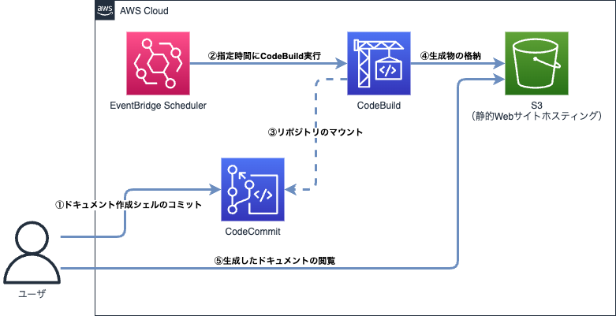
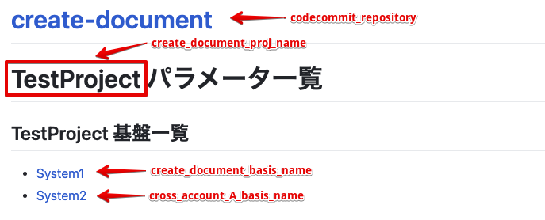
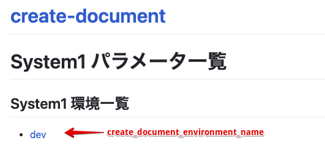

# AWSサービスのみでパラメータシート作成シェル実行環境を構築する場合

- [構成概要](#構成概要)
- [各リソースの用途](#各リソースの用途)
- [修正するファイル](#修正するファイル)
- [基本設定](#基本設定)
- [S3のアクセス制限（重要）](#s3のアクセス制限重要)
- [セットアップ方法](#セットアップ方法)
- [複数アカウントのパラメータを取得する場合の設定](#複数アカウントのパラメータを取得する場合の設定)

## 構成概要



## 各リソースの用途

|リソース|使用用途|備考|
|:--|:--|:--|
|EventBridge Scheduler|指定時間にCodeBuildの実行|CodeBuildを実行する時間を指定|
|CodeCommit|パラメータシート作成シェル関連ファイルを格納|手動でパラメータシート作成シェル関連ファイルをコミット|
|CodeBuild|AWSリソース情報の取得<br>ドキュメントの生成<br>S3への生成ドキュメントの格納|ログはCloudWatch Logsに格納|
|S3|生成ドキュメントの格納<br>静的Webサイトホスティングでドキュメント公開|アドレス制限等行う必要あり|

## 修正するファイル

|ファイル名|設定内容|
|:--|:--|
|_local_variables.tf|各種リソース名等を指定|
|_shared_variables.tf|プロジェクト名、環境名を指定|
|_terraform.tf|各システムに合わせて設定|

## 基本設定
各環境に合わせて以下のファイルや環境変数を変更する。

- [_local_variables.tfでシステムごとに変更する設定](#_local_variablestfでシステムごとに変更する設定)
  - [eb_schedule_cron](#eb_schedule_cron)
  - [create_document_src_dir](#create_document_src_dir)
  - [create_document_protocol](#create_document_protocol)
  - [create_document_basis_name、cross_account_x_basis_name](#create_document_basis_namecross_account_x_basis_name)
  - [create_document_environment_name、cross_account_x_environment_name](#create_document_environment_namecross_account_x_environment_name)
  - [create_document_proj_name](#create_document_proj_name)
- [S3のアクセス制限（重要）](#s3のアクセス制限重要)
- [各環境変数の画面表示について](#各環境変数の画面表示について)

### _local_variables.tfでシステムごとに変更する設定
以下にリソース名や基本設定以外でシステムごとに変更する設定を示す。

#### eb_schedule_cron
EventBridge SchedulerでCodeBuildを実行する時間を指定する。

#### create_document_src_dir
パラメータシート作成シェルはデフォルトで`docs`配下に生成ドキュメントを出力するが、別のディレクトリにする場合に変更する。

#### create_document_protocol
静的Webサイトホスティングする場合、プロトコルが`HTTP`となるが、CloudFront等を使って`HTTPS`化する場合に変更する。

#### create_document_basis_name、cross_account_x_basis_name
各システム基盤名を指定する。

パラメータシート作成シェルの`resource_list`のファイルにも関連するため、変更する場合はパラメータシート作成シェル側も変更すること。

#### create_document_environment_name、cross_account_x_environment_name
各環境名を指定する。

`dev`や`stg`等の環境名を指定すること。

#### create_document_proj_name
プロジェクト名を指定する。

パラメータシート作成シェルでドキュメント生成した際にタイトル部分の表示名となる。

### S3のアクセス制限（重要）
静的Webサイトホスティングのみでドキュメント公開する場合、アクセス制限を行わないと不特定多数のユーザからアクセス可能な全体公開の状態となるため、企業向けシステムのパラメータは絶対に公開しないこと。

そのため以下のような`s3.tf`のバケットポリシー等でアドレス制限を行うか、`CloudFront`、`AWS WAF`等を使用して制限すること。

```json
【抜粋】
        Condition = {
          IpAddress = {
            "aws:SourceIp" = [
              "192.0.2.1/32",
              "198.51.100.1/32",
            ]
          }
        }
```

#### 各環境変数の画面表示について
「**_local_variables.tf**」で指定している環境変数で、パラメータ一覧画面の表示項目に関連する環境変数について以下に示す。



「**System1**」のページに遷移した画面の表示項目と環境変数について以下に示す。



## セットアップ方法
AWSの各種リソースを`terraform`で作成を行う。

- [各種リソースの作成](#各種リソースの作成)
- [パラメータシート作成用シェルのコミット](#パラメータシート作成用シェルのコミット)
- [CodeBuildの実行](#codebuildの実行)
- [パラメータ一覧ページへのアクセス](#パラメータ一覧ページへのアクセス)
- [セットアップ後の定期実行](#セットアップ後の定期実行)

### 各種リソースの作成
`terraform`ディレクトリ配下の「`create_document_codebuild`」の各種ローカル変数等を設定して`terraform apply`でAWSの各種リソースを作成する。

```bash
cd create_document_codebuild
terraform apply
```

### パラメータシート作成用シェルのコミット
作成したCodeCommitリポジトリに「`create_document_shell`」配下のファイルをコミットする。

### CodeBuildの実行
CodeBuildダッシュボードの「**ビルド・CodeBuild**」→「**ビルドプロジェクト**」で作成したビルドプロジェクトを作成し、「**ビルドを開始**」→「**今すぐ始める**」を実行する。

### パラメータ一覧ページへのアクセス
CodeBuild実行成功後、S3ダッシュボードの「**バケット**」から作成したS3バケットを選択し、「**プロパティ**」タブの「**静的ウェブサイトホスティング**」から「**バケットウェブサイトエンドポイント**」のURLを選択して生成したパラメータ一覧ページにアクセスする。

- `http://[S3バケット名].s3-website-ap-northeast-1.amazonaws.com`

### セットアップ後の定期実行
セットアップ後はEventBridge Schedulerで指定しているcron定義に従って、定期的に実行される。

## 複数アカウントのパラメータを取得する場合の設定
複数システム、複数環境のパラメータを取得する場合、以下のように設定を行うことで１つのパラメータ一覧の画面上に複数システム、複数環境の情報を表示させる。

- [クロスアカウントアクセス用_local_variables.tfの設定](#クロスアカウントアクセス用_local_variablestfの設定)
  - [default_account_id](#default_account_id)
  - [cross_account_x_profile_name](#cross_account_x_profile_name)
  - [cross_account_x_account_id](#cross_account_x_account_id)
  - [cross_account_x_iam_role_name](#cross_account_x_iam_role_name)
- [buildspec.ymlの設定](#buildspecymlの設定)
- [codebuild.tfの設定](#codebuildtfの設定)
- [iam.tfの設定](#iamtfの設定)
- [クロスアカウントアクセス先IAMロールとローカル変数の設定](#クロスアカウントアクセス先iamロールとローカル変数の設定)
- [パラメータシート作成シェル側の設定](#パラメータシート作成シェル側の設定)

### クロスアカウントアクセス用_local_variables.tfの設定
`_local_variables.tf`内のクロスアカウント用ローカル変数のコメントアウトを外し、以下のように変数を設定する。

また、複数アカウントがある場合は`cross_account_x`の`x`部分を別の変数名にして複数の変数を作成する。

#### default_account_id
`CodeBuild`を実行するアカウント（スイッチロール元のアカウント）のアカウントIDを指定する。

#### cross_account_x_profile_name
`CodeBuild`内で作成している追加プロファイル名のため、任意の名前で指定する。

#### cross_account_x_account_id
クロスアカウントアクセス先のアカウントIDを指定する。

#### cross_account_x_iam_role_name
クロスアカウントアクセス先でクロスアカウントアクセス用のIAMロールを作成する際のIAMロール名を指定する。

### buildspec.ymlの設定
`source`ディレクトリ内にある`buildspec.yml`の`# --- ここから ---`から`# --- ここまで ---`のコメントアウトを外す（２箇所）。

複数アカウントがある場合は`# --- ここから ---`から`# --- ここまで ---`の部分を複製し、`${CROSS_ACCOUNT_x_〜}`の変数を修正する。

### codebuild.tfの設定
`codebuild.tf`内のクロスアカウントアクセス用環境変数のコメントアウトを外す。

複数アカウントがある場合は`# --- ここから ---`から`# --- ここまで ---`の部分を複製し、先程設定した変数名に変更する。

### iam.tfの設定
`iam.tf`内のクロスアカウントアクセス用IAMポリシーの`# --- ここから ---`から`# --- ここまで ---`のコメントアウトを外す。

複数アカウントがある場合は`resources`にアカウント数分のARNを追加する。

### クロスアカウントアクセス先IAMロールとローカル変数の設定
`source`ディレクトリ内にある`iam_cross_account.tf`と`_local_variables.tf`をクロスアカウント先に持っていき、`terraform`で反映する。

### パラメータシート作成シェル側の設定
先ほど`_local_variables.tf`で指定したシステム基盤名に合わせて`resource_list`のファイルを作成する。
