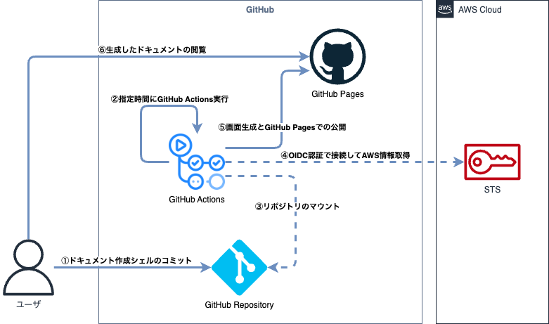
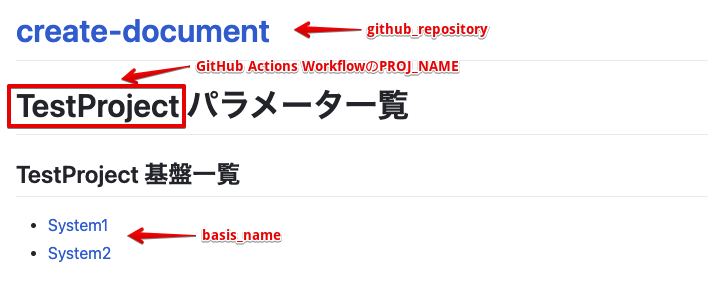

# GitHub ActionsとGitHub Pagesを使ってパラメータシート作成用シェル実行環境を構築する場合

- [構成概要](#構成概要)
- [各リソースの用途](#各リソースの用途)
- [修正するファイル](#修正するファイル)
- [基本設定](#基本設定)
- [セットアップ方法](#セットアップ方法)
- [GitHub Pagesのアクセスについて（重要）](#github-pagesのアクセスについて重要)
- [複数アカウントのパラメータを取得する場合の設定](#複数アカウントのパラメータを取得する場合の設定)

## 構成概要



## 各リソースの用途

|リソース|使用用途|備考|
|:--|:--|:--|
|GitHub Actions|指定時間にGitHub Actions実行<br>AWSリソース情報の取得<br>ドキュメントの生成|GitHub Actions実行時間を指定|
|GitHub Repository|パラメータシート作成用シェル関連ファイルを格納|手動でパラメータシート作成用シェル関連ファイルをコミット|
|IAM|GitHub Actionsのアクセスの受け付け|ログはCloudWatch Logsに格納|

## 修正するファイル

|ファイル名|設定内容|
|:--|:--|
|_local_variables.tf|各種リソース名等を指定|
|_shared_variables.tf|プロジェクト名、環境名を指定|
|_terraform.tf|各システムに合わせて設定|

## 基本設定
各環境に合わせて以下のファイルや環境変数を変更する。

- [_local_variables.tfでシステムごとに変更する設定](#_local_variablestfでシステムごとに変更する設定)
  - [github_account_name](#github_account_name)
  - [github_pages_branch](#github_pages_branch)
  - [github_pages_path](#github_pages_path)
  - [パラメータシート作成シェル実行用変数設定](#パラメータシート作成シェル実行用変数設定)
  - [GitHub Actions Workflowファイルの指定](#github-actions-workflowファイルの指定)
  - [各環境変数の画面表示について](#各環境変数の画面表示について)

### _local_variables.tfでシステムごとに変更する設定
以下にリソース名や基本設定以外でシステムごとに変更する必要のある設定を示す。

#### github_account_name
使用するGitHubリポジトリが存在するアカウント名を指定する。

#### github_pages_branch
GitHub Pagesで公開するブランチの指定。

#### github_pages_path
GitHub Pagesで公開するディレクトリの指定。

#### パラメータシート作成シェル実行用変数設定
パラメータシート作成シェル内で使用する変数をGithub Environment Variable、Environment Secretsに登録するため、`basis_list`に以下書式で指定する。

`basis_name`はパラメータシート作成シェルの「**resource_list**」で指定するリソースリストファイル名「**[basis_name]_list**」に紐づいているため、「**resource_list**」側も修正すること。

```hcl
locals {
  basis_list = {
    [システム名、環境名等を指定] = {
      iam_role_arn = [GitHub ActionsからAWSにアクセスするためのIAMロールARNを指定]
      basis_name   = [システム名を指定]
    }
  }
}
```

複数の環境を指定する場合の例を以下に示す。

```hcl
locals {
  basis_list = {
    system1_dev = {
      iam_role_arn = "arn:aws:iam::123456789012:role/github-document-role",
      basis_name   = "System1"
    },
    system1_prd = {
      iam_role_arn = "arn:aws:iam::987654321098:role/github-document-role",
      basis_name   = "Ststem1"
    }
  }
}
```

#### GitHub Actions Workflowファイルの指定
GitHubリポジトリにデプロイするワークフローファイルを指定する。

```hcl
locals {
  workflow_file = {
    [パス名] = {
      filepath = "[GitHub Actions Workflowファイルパス]",
    }
  }
}
```

dev用、prod用等でワークフローファイルを分ける場合の例を以下に示す。

```hcl
locals {
  workflow_file = {
    create_document_dev = {
      filepath = ".github/workflows/create_document_dev.yml",
    }
    create_document_prd = {
      filepath = ".github/workflows/create_document_prd.yml",
    }
  }
}
```

但し、ワークフローファイルを複数作成する場合、ワークフローファイル内で指定している実行開始時間が同じだと、生成物のコミット時に競合が発生し失敗する。

他のワークフローファイルが実行されていない時間を指定すること。

```yml
on:
  schedule:
    - cron: '10 18 * * *'
```

#### 各環境変数の画面表示について
「**_local_variables.tf**」やGitHub Workflowファイルの「**create_document_xxx.yml**」で指定している環境変数で、パラメータ一覧画面の表示項目に関連する環境変数について以下に示す。



「**System1**」のページに遷移した画面の表示項目と環境変数について以下に示す。


## セットアップ方法
AWS側設定、GitHub設定について`terraform`で作成を行う。

なお、GitHub用の`tfstate`ファイルはS3に格納するものとし事前にバックエンドの設定を行っておくものとする。

- [GitHubアクセス用トークンの作成](#githubアクセス用トークンの作成)
- [GitHubリポジトリの作成](#githubリポジトリの作成)
- [パラメータシート作成用シェルのコミット](#パラメータシート作成用シェルのコミット)
- [GitHub Actionsからのアクセス用IAMロールの作成](#github-actionsからのアクセス用iamロールの作成)
- [GitHub Actions Workflowの実行](#github-actions-workflowの実行)
- [パラメータ一覧ページへのアクセス](#パラメータ一覧ページへのアクセス)
- [セットアップ後の定期実行](#セットアップ後の定期実行)
- [GitHub Pagesのアクセスについて（重要）](#github-pagesのアクセスについて重要)

### GitHubアクセス用トークンの作成
GitHubの個人ページより「**Settings**」→「**Developer settings**」→「**Personal access tokens**」→「**Tokens (classic)**」から「**Generate new token (classic)**」でアクセストークンを生成する。

生成したアクセストークンを控え、`terraform`ディレクトリ配下の「`create_document_github`」→「`github`」配下に「`.env`」というファイルを作成して以下内容を記載する。

```bash
export GITHUB_TOKEN="[先ほど生成したGitHubアクセストークン]"
export GITHUB_OWNER="[GitHub Actionsを実行するリポジトリを管理するオーナー]"

export TF_VAR_github_token="[先ほど生成したGitHubアクセストークン]"
export TF_VAR_github_owner="[GitHub Actionsを実行するリポジトリを管理するオーナー]"
```

### GitHubリポジトリの作成
「`create_document_github/github`」配下に移動し、`source`コマンドでGitHubアクセストークンを指定する。

```bash
cd create_document_github/github
source .env
```

各種ローカル変数等を設定して`terraform apply`でGitHub側リポジトリ等を作成する。

```bash
terraform apply
```

### パラメータシート作成用シェルのコミット
作成したリポジトリに「`create_document_shell`」配下のファイルをコミットする。

### GitHub Actionsからのアクセス用IAMロールの作成
`terraform`を実行し、AWS側環境にGitHub ActionsからのアクセスをOIDCで受け付けるためのIDプロバイダとIAMロールを作成する。

```bash
cd create_document_github/aws
terraform apply
```

複数環境のパラメータを取得する場合は各環境用に変数やterraform基本設定を行い、各環境ごとにIDプロバイダとIAMロールを作成する。

### GitHub Actions Workflowの実行
作成したGitHubのリポジトリから「**Actions**」の「**xxxxx Create Document**」より「**Run workflow**」を実行する。

ドキュメント生成後、GitHub Pages用の画面を生成する「**pages-build-deployment**」ワークフローが実行されるので、終了するまで待つ。

### パラメータ一覧ページへのアクセス
GitHub Actions Workflow実行成功後、リポジトリの「**Settings**」→「**Pages**」より「**Visit site**」で生成したパラメータ一覧ページにアクセスする。

### セットアップ後の定期実行
セットアップ後はワークフローファイルで指定しているcron定義に従って、定期的に実行される。

### GitHub Pagesのアクセスについて（重要）
GitHub Pagesの公開ページは通常アカウントの場合、「**Private**」のアクセス権では公開できず、「**Public**」のアクセス権でしか公開できないことから基本的に全体公開となるため、企業向けシステムのパラメータは絶対に公開しないこと。

特定ユーザのみに公開する場合は、GitHub Organization設定を行い、Team設定等で適切な権限設定を行ったうえで「**Internal**」のアクセス権を付与したリポジトリを公開するようにすること。

## 複数アカウントのパラメータを取得する場合の設定
複数システム、複数環境のパラメータを取得する場合、以下のように設定を行うことで１つのGitHub Pagesの画面上に複数システム、複数環境の情報を表示させる。

- [GitHub用_local_variables.tfの設定](#github用_local_variablestfの設定)
- [ワークフローファイルを分ける場合の_local_variables.tfの設定](#ワークフローファイルを分ける場合の_local_variablestfの設定)

### GitHub用_local_variables.tfの設定
GitHub用`terraform`の`_local_variables.tf`の「**GitHub Actions用環境変数**」に記載されている`# --- ここから ---`から`# --- ここまで ---`のコメントアウトを外す。

`basis_name`で既に設定されているシステム名とは別のシステム名を指定する場合、パラメータシート作成シェルの「**resource_list**」で指定するリソースリストファイル「**[basis_name]_list**」も新たに作成すること。

### ワークフローファイルを分ける場合の_local_variables.tfの設定
dev用、prod用等でワークフローファイルを分ける場合、GitHub用`terraform`の`_local_variables.tf`の「**GitHub Actions Workflowファイル**」に記載されている`# --- ここから ---`から`# --- ここまで ---`のコメントアウトを外す。

`filepath`で指定するワークフローファイルを新たに作成し、ワークフローファイル内で指定している各種変数の設定を行う。
