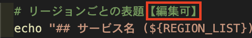
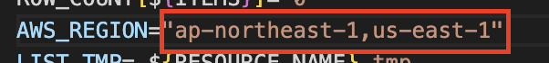
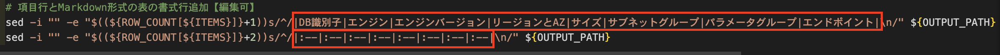
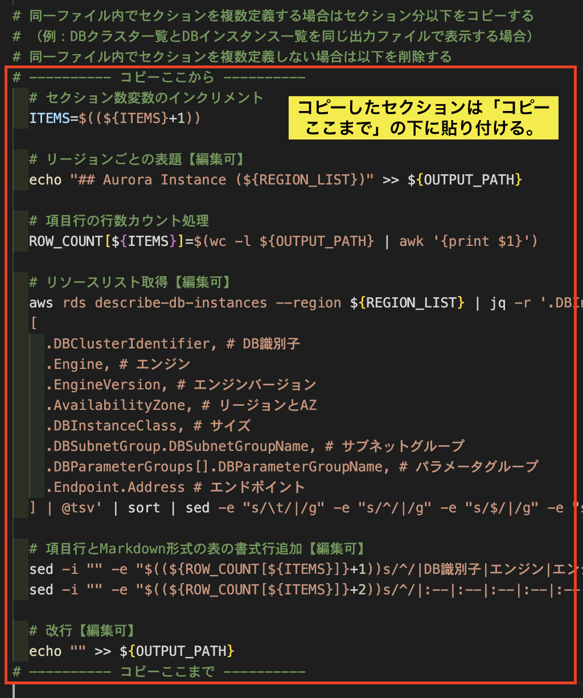
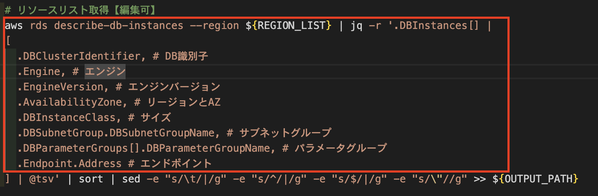

# パラメータシート作成用シェルの使い方
本ドキュメントはパラメータシート作成用シェルの実行方法と、各AWSリソース取得用シェルの作成方法について示す。

- [パラメータシート作成用シェルの構造](#パラメータシート作成用シェルの構造)
- [パラメータシート作成用シェル実行方法](#パラメータシート作成用シェル実行方法)
    - [オプション](#オプション)
    - [指定可能なリソース名](#指定可能なリソース名)
    - [複数システム、複数環境の情報を取得する場合の例](#複数システム複数環境の情報を取得する場合の例)
- [AWS WAFのIPsets備考欄に名称等記載する方法](#aws-wafのipsets備考欄に名称等記載する方法)
- [リソース情報取得シェルの作成方法](#リソース情報取得シェルの作成方法)
    - [基本的に【編集可】の部分を修正する。](#基本的に編集可の部分を修正する)
    - [複数リージョン指定する場合はカンマで区切る](#複数リージョン指定する場合はカンマで区切る)
    - [表の項目名は情報に合わせて任意に書き換える](#表の項目名は情報に合わせて任意に書き換える)
    - [複数の表を書く場合、コピー箇所をコピーして使う](#複数の表を書く場合コピー箇所をコピーして使う)
    - [aws-cliで取得したリソース情報を加工する](#aws-cliで取得したリソース情報を加工する)
- [jqコマンドによるjsonファイル加工](#jqコマンドによるjsonファイル加工)
    - [JSONの表記方法](#jsonの表記方法)
    - [殻剥き](#殻剥き)
    - [値がない場合にハイフンを指定する](#値がない場合にハイフンを指定する)
    - [1項目の結果が複数になる場合に改行を付与する](#1項目の結果が複数になる場合に改行を付与する)
    - [出力値から一部だけ取得する](#出力値から一部だけ取得する)
    - [特定のキーの値のみ取得する](#特定のキーの値のみ取得する)
    - [IsClusterWriterがfalseの項目のインスタンス名のみ取得する](#isclusterwriterがfalseの項目のインスタンス名のみ取得する)

## パラメータシート作成用シェルの構造
パラメータシート作成用シェルで登場するファイル・ディレクトリについて以下に示す。

```bash
.
├── docs
│   └── output_file
├── resource
│   └── resource_file
├── resource_list
│   └── resource_list_file
├── contents.sh
├── create_document.sh
├── ip_addresses.json
└── template
    └── resource_template
```

|ファイル・ディレクトリ|説明|
|:--|:--|
|docs|create_document.shで実行した結果のパラメータシートが出力される|
|resource|各種AWSリソースを取得するためのコマンド等が記載されたシェル|
|resource_list|各システムごとに取得するAWSリソースを記載したリソース一覧|
|contents.sh|各システム、各環境ごとのリソース一覧を作成する際にindex.mdファイルを生成するためのシェル|
|create_document.sh|メインシェル。パラメータシートを作成するシェル|
|ip_addresses.json|AWS WAFの情報を取得する際、IPsetsの備考欄にIPアドレスに紐付く名称、説明を記載するためのファイル|
|template|リソース情報取得シェルのテンプレート|

## パラメータシート作成用シェル実行方法
パラメータシート作成シェルを実行するには`./create_document.sh [ResourceName]`を指定して実行する。

以下は`cloudwatch`の情報を取得する場合の例。

```bash
./create_document.sh Cloudwatch
```

以下Usage情報例

```bash
Usage: create_document.sh [-ch] [-f outputfilename] [-i resourcedir] [-o outputdir] ResourceName
  -c : CSV形式で出力
  -f : 出力ファイル名の指定（拡張子は不要）
  -h : コマンドヘルプ
  -i : リソースファイル格納ディレクトリの指定
  -o : 出力ファイル格納ディレクトリの指定

指定可能な[ResourceName]
[all]の場合はリソースファイル格納ディレクトリ内のリソース全てを実行
但し[-f]オプションと併用不可
	all
	Cloudfront_Distribution
	Cloudfront_Policy
	Cloudwatch
	EC2
	ELB
	RDS
	S3
	WAF
```

### オプション
`create_document.sh`は以下のオプションを付与することで出力等の場所を変更できる。

|オプション|説明|
|:--|:--|
|-c|パラメータシートの出力をCSV形式に変更する（デフォルト：Markdown）|
|-f|出力ファイル名を任意に指定する。（デフォルト：`[リソース名]_list.md`）|
|-h|Usage情報の表示|
|-i|リソース情報取得シェルが格納されているディレクトリを指定する（デフォルト：resourceディレクトリ）|
|-o|パラメータシートを出力するディレクトリを指定する（デフォルト：docstディレクトリ）

### 指定可能なリソース名
`resource`ディレクトリに格納されているリソース情報取得シェルの名前と`all`を指定することができる。

以下のように`all`を指定した場合は`resource`ディレクトリに格納されているリソース全てを取得する。

```bash
./create_document.sh all
```

指定できるリソース名がわからない場合は、コマンドのUsageを表示させることで、指定できるリソース名が確認できるため、Usageを確認するか、`resource`ディレクトリに格納されているシェル名を確認する。

### 複数システム、複数環境の情報を取得する場合の例
以下のように出力ディレクトリを変更することで複数環境の情報を取得することができる。

```bash
./create_document.sh -o "docs/SystemName1/dev/" all
./create_document.sh -o "docs/SystemName1/prd/" all
./create_document.sh -o "docs/SystemName2/dev/" EC2
./create_document.sh -o "docs/SystemName2/prd/" EC2
```

`resource_list`ディレクトリ配下のリソースリストを以下のように指定することで、リソースリストに記載しているリソース情報のみ取得することができる。

```bash
while read RESOURCE
  ./create_document.sh -o "docs/SystemName1/dev/" ${RESOURCE}
done < resource_list/SystemName1_list
```

`contents.sh`を以下のように指定して実行することで、各ディレクトリに環境やリソースの一覧が記載された`index.md`ファイルを生成することができる。

```bash
./contents.sh SystemName1 dev https://localhost/docs ProjectName 
```

上記のように個別に実行することも可能だが、GitHub Actions等を使って生成するのが良い。

## AWS WAFのIPsets備考欄に名称等記載する方法
`ip_addresses.json`に「**[IPアドレス]:[IPアドレスの名称・説明]**」を以下のように記載することで、AWS WAFのIPsetsを生成する際、備考欄にIPアドレスの名称や説明等を記載できる。

```json
{
  "192.0.2.1/32":"システムAグローバルIPアドレス",
  "198.51.100.1/32":"システムBグローバルIPアドレス",
  "203.0.113.1/32":"システムCグローバルIPアドレス"
}
```

## リソース情報取得シェルの作成方法
テンプレートから新たにリソース情報取得シェルを作成する方法について示す。

- [基本的に【編集可】の部分を修正する。](#基本的に編集可の部分を修正する)
- [複数リージョン指定する場合はカンマで区切る](#複数リージョン指定する場合はカンマで区切る)
- [表の項目名は情報に合わせて任意に書き換える](#表の項目名は情報に合わせて任意に書き換える)
- [複数の表を書く場合、コピー箇所をコピーして使う](#複数の表を書く場合コピー箇所をコピーして使う)
- [aws-cliで取得したリソース情報を加工する](#aws-cliで取得したリソース情報を加工する)

### 基本的に【編集可】の部分を修正する。
テンプレートファイルの中で基本的に【編集可】のコメントが書かれている箇所を新たに取得するリソース用に修正する。

但し、取得内容によっては他の部分を修正する必要がある場合もあるため、リソースにより柔軟に対応する。



また、テンプレートファイルのうち、【編集可】が記載されている箇所の内容は以下となる。

|【編集可】が記載されている場所の処理|内容|
|:--|:--|
|タイトル部分|パラメータシートの表題。リソース名等を指定|
|リージョンごとの表題|各種機能名等を記載。名前の後ろにリージョン名が付与される|
|リソースリスト取得|メインの処理。コマンドでAWSリソース情報を取得してくる。以下後述|
|項目行とMarkdown形式の表の書式行追加|表の項目名と書式設定|
|改行|表と表の間に改行を付与する。見やすくなるように任意に追加|

### 複数リージョン指定する場合はカンマで区切る
`AWS WAF`や`CloudWatch`など、複数リージョンに存在するものは以下のように環境変数の設定箇所でカンマで区切って指定する。



### 表の項目名は情報に合わせて任意に書き換える
赤字部分をマークダウン形式で取得する情報に合わせて書き換える。

以下2行目の`|:--`は項目数と同じ数記載する。



### 複数の表を書く場合、コピー箇所をコピーして使う
同じパラメータシート上で複数の機能（例えばECSのクラスタ一覧とサービス一覧を出力する場合など）の一覧を出力する場合、「**# ---------- コピーここから ----------**」から「**# ---------- コピーここまで ----------**」をコピーして、表の数分追加する。



### aws-cliで取得したリソース情報を加工する
aws-cliで取得したリソース情報を`jq`コマンドで表敬式に加工することでパラメータシートの形式で情報を取得する。

コマンド最終行の`] | @tsv' |〜`の部分は編集しなくて良いので以下コマンド部分と取得パラメータ部分を作成する。



以下より細かい作成方法を示す。

## jqコマンドによるjsonファイル加工
`jq`コマンドで表形式に整形する方法を以下に示す。

- [JSONの表記方法](#jsonの表記方法)
- [殻剥き](#殻剥き)
- [値がない場合にハイフンを指定する](#値がない場合にハイフンを指定する)
- [1項目の結果が複数になる場合に改行を付与する](#1項目の結果が複数になる場合に改行を付与する)
- [出力値から一部だけ取得する](#出力値から一部だけ取得する)
- [特定のキーの値のみ取得する](#特定のキーの値のみ取得する)
- [IsClusterWriterがfalseの項目のインスタンス名のみ取得する](#isclusterwriterがfalseの項目のインスタンス名のみ取得する)

### JSONの表記方法
JSONは`{}`の段落は`.`で示され、リスト形式の場合は`[]`で示す。

例えば以下`Engine`の値を示す場合は`.DBInstances[].Engine`で指定できる。

```json
{
    "DBInstances": [
        {
            "DBInstanceIdentifier": "system1-dev-rds-01",
            "DBInstanceClass": "db.t3.medium",
            "Engine": "aurora-mysql",
            "DBInstanceStatus": "available",
            "MasterUsername": "admin",
            "DBName": "rds",
            "Endpoint": {
                "Address": "system1-dev-rds-01.xxxxxxxxxxxx.ap-northeast-1.rds.amazonaws.com",
                "Port": 3306,
                "HostedZoneId": "ZXXXXXXXXXXXXX"
            },
```

### 殻剥き
JSONを表敬式としたい場合、1つのリストの塊を表の1行分として表示させたいが、以下のようにリスト形式の中で更にリスト形式の項目があった場合（以下`VpcSecurityGroups`）、表が1行と見なされなくなる。

```json
{
    "DBInstances": [
        {
            "DBInstanceIdentifier": "system1-dev-rds-01",
            (省略)
            "VpcSecurityGroups": [
                {
                    "VpcSecurityGroupId": "sg-xxxxxxxxxxxxxxxxx",
                    "Status": "active"
                }
            ],
            (省略)
        },
        {
            "DBInstanceIdentifier": "system1-dev-rds-02",
            (省略)
            "VpcSecurityGroups": [
                {
                    "VpcSecurityGroupId": "sg-xxxxxxxxxxxxxxxxx",
                    "Status": "active"
                }
            ],
            (省略)
        },
    ]
}
```

以下のように`VpcSecurityGroups[]`といった指定をすることにより、リスト内の特定の項目をリスト分取得できる。

`jq -r '.DBInstances[] | [.VpcSecurityGroups[].VpcSecurityGroupId]'`

### 値がない場合にハイフンを指定する
値が存在しない場合がある場合、`.[項目名] // "-"`とすることで値が無い場合にハイフンを付与する。

```json
  aws ec2 describe-instances --region ${REGION_LIST} | jq -r '.Reservations[].Instances[] |
  [
    (省略)
    .PublicIpAddress // "-", # パブリックIP
    (省略)
  ] | @tsv' | sort | sed -e "s/\t/|/g" -e "s/^/|/g" -e "s/$/|/g" -e "s/\"//g" >> ${OUTPUT_PATH}
```

### 1項目の結果が複数になる場合に改行を付与する
1行の結果が複数となる場合、`.[項目名] | map(.GroupName) | join("<br>"))`とすることで間に改行を挟むことができる。

```json
  aws ec2 describe-instances --region ${REGION_LIST} | jq -r '.Reservations[].Instances[] |
  [
    (省略)
    (.SecurityGroups // "-" | map(.GroupName) | join("<br>")), # セキュリティグループ
    (省略)
  ] | @tsv' | sort | sed -e "s/\t/|/g" -e "s/^/|/g" -e "s/$/|/g" -e "s/\"//g" >> ${OUTPUT_PATH}
```

### 出力値から一部だけ取得する
`(.IamInstanceProfile.Arn // "-" | split("/") | .[-1])`のように指定すると、`/`をデリミタとして後ろから数えて1つ目の値を取得するといったことができる。


- 加工前出力例
```json
"arn:aws:iam::123456789012:instance-profile/system1-instance"
```

- 加工後出力例
```json
"system1-instance"
```

### 特定のキーの値のみ取得する
`(.Tags[] | select(.Key == "Name").Value)`のように取得した値の中から出力したいキー値をselectで指定することで指定したキーのValue値を取得できる。

- 加工前出力例
```json
[
  {
    "Key": "Env",
    "Value": "dev"
  },
  {
    "Key": "Name",
    "Value": "Development"
  }
]
[
  {
    "Key": "env",
    "Value": "dev"
  },
  {
    "Key": "Name",
    "Value": "system1-instance"
  },
  {
    "Key": "project",
    "Value": "system1"
  }
]
```

- 加工後出力例
```json
[
  "Development"
]
[
  "system1-instance"
]
```

### IsClusterWriterがfalseの項目のインスタンス名のみ取得する
`([(.DBClusterMembers[] | select(.IsClusterWriter == false).DBInstanceIdentifier)] | join("<br>"))`といった指定を行うことで、IsClusterWriterがfalseの項目のみ取得できる。

- 加工前出力例
```json
[
  [
    {
      "DBInstanceIdentifier": "system1-dev-rds1-02",
      "IsClusterWriter": true,
      "DBClusterParameterGroupStatus": "in-sync",
      "PromotionTier": 0
    },
    {
      "DBInstanceIdentifier": "system1-dev-rds1-01",
      "IsClusterWriter": false,
      "DBClusterParameterGroupStatus": "in-sync",
      "PromotionTier": 0
    }
  ]
]
[
  [
    {
      "DBInstanceIdentifier": "system1-dev-rds2-02",
      "IsClusterWriter": false,
      "DBClusterParameterGroupStatus": "in-sync",
      "PromotionTier": 0
    },
    {
      "DBInstanceIdentifier": "system1-dev-rds2-01",
      "IsClusterWriter": true,
      "DBClusterParameterGroupStatus": "in-sync",
      "PromotionTier": 0
    }
  ]
]
```

- 加工後出力例
```json
[
  [
    "system1-dev-rds1-01"
  ]
]
[
  [
    "system1-dev-rds2-02"
  ]
]
```
